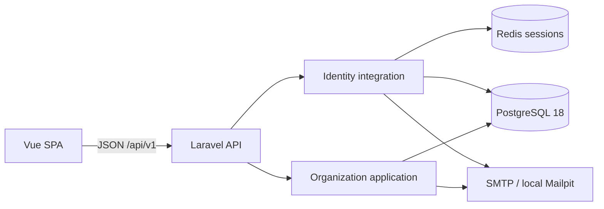

# System overview

CoreERP is a pragmatic DDD-oriented modular monolith with independent Laravel and Vue applications:

Phase 1.4 is implemented locally, awaiting review. Phase 1.5B adds Audit recording contracts and PostgreSQL append-only persistence only; business commands are not instrumented, and no audit query/API/UI is available. Later ERP/notification modules remain unimplemented. See [ADR 0005](../decisions/0005-ddd-modular-monolith-architecture.md), [ADR 0006](../decisions/0006-organization-membership-lifecycle-and-invitations.md), [ADR 0007](../decisions/0007-audit-trail-architecture.md), the [roadmap](../phases/phase-01-core-platform.md) and [audit validation record](../phases/phase-01-audit-trail-validation.md).

## Bounded contexts and layers

Audit is a supporting module with Application contracts, readonly producer input, stable enums and strict action-specific payload validation, plus Infrastructure Query Builder persistence/provider wiring. It has no Domain, Eloquent model or Presentation layer. The recorder requires a caller-owned physical PostgreSQL transaction and uses the default application connection. Explicit tenant/actor FKs, JSON/size constraints and unconditional statement-level UPDATE/DELETE/TRUNCATE rejection protect storage. No Organization command calls it yet. Producer imports will be limited to Audit Application Contracts/Data/Vocabulary; Audit imports no Organization or Identity code. See ADR 0007 for schema, actor/privacy choices, operational limits and later integration.

Identity owns credentials, registration, login/logout, email verification, password recovery and the current-user representation. Its existing Eloquent User, Fortify adapters/provider, HTTP responses and current-user controller/resource remain in Infrastructure and Presentation. No artificial Identity Domain/Application layers are needed. Identity has no Organization dependency.

Organization owns tenant identity, ownership, memberships, tenant roles/permissions/grants and invitations together. New functionality belongs in these layers:

| Layer | Responsibilities |
| --- | --- |
| Domain | PermissionKey, MembershipStatus, InvitationState; pure role tenant compatibility, owner membership protection and verified invitation identity/lifecycle rules |
| Application | Explicit actor/tenant authorization, commands, queries, transaction boundaries and row locking |
| Infrastructure | Eloquent models/relationships, OrganizationPolicy/AccessResponse adapters, provider and synchronous SMTP invitation delivery |
| Presentation | Thin HTTP controllers, authorization-first Form Requests, deliberate Resources and Domain/Application failure mapping |

Application uses documented same-module Eloquent/DB lightweight paths and a concrete Organization SMTP adapter. Domain is framework-independent. No duplicate aggregates, repositories, buses, events, hidden model-observer workflows, generic Shared Kernel or future modules were introduced. Platform liveness/readiness remain outside business contexts. Migrations, routes, configuration, factories and seeders retain conventional Laravel locations.

Seven Organization adapters reference Identity User: Organization::owner, OrganizationMembership::user, OrganizationPolicy and four authenticated HTTP controllers (organization, role, member and invitation). Application receives explicit trusted user ID/email/verification values; it imports no Identity Infrastructure. Relationship-based member reads expose only deliberate User columns. Architecture allowlists are precise, not a general cross-context exception.

## Application and domain behavior

Existing `CreateOrganization`, `RenameOrganization`, `SaveRole`, `ListOrganizations` and internal `AssignMembershipRole` remain. New commands are `CreateInvitation`, `AcceptInvitation`, `RevokeInvitation`, `SyncMembershipRoles`, `SuspendMembership`, `ActivateMembership` and `RemoveMembership`. Internal `ResolveOrganizationRoles` and `LockManagedMembership` share only the concrete tenant/locking operations their callers need.

Controllers do not write business data or own transactions. Policies and directly invoked authorized writes reuse OrganizationAccess. Membership commands lock the organization then the scoped membership; invitation commands use organization then invitation. `AcceptInvitation` validates the token, verified matching email, state and expiration before creating the membership, calling AssignMembershipRole for all grants and marking the invitation accepted inside one transaction. Existing membership is always rejected, including suspended membership.

Domain tests do not boot Laravel or touch a database. `MembershipRules` rejects owner suspension/removal. `InvitationRules` normalizes email, requires a verified matching identity and checks the pending/unexpired state using supplied time. `RoleAssignmentRules` requires same-organization grants. PostgreSQL independently protects these persistence invariants where practical; pure rules do not replace constraint tests.

## Tenancy, membership and authorization

Organizations use public ULIDs in a shared schema. Membership IDs retain existing bigint conventions; invitation and role IDs are ULIDs. Tenant context comes explicitly from the route/use-case arguments, never a global, session-selected tenant, User current organization or browser storage. All future tenant-owned tables must carry scoped keys and authorization.

Memberships now have `active`/`suspended` status. Suspension retains roles but removes organization access and effective RBAC on subsequent checks. ListOrganizations includes active memberships only. Reactivation reuses the existing membership and grants. Removal deletes membership and cascades its grant links, leaving User and Role definitions intact.

Owner identity remains the explicit `owner_user_id`, independent of roles. The owner must have an active membership. The original deferred owner-membership FK is retained and strengthened by a second deferred composite active-status FK. Creation still inserts organization and owner membership atomically. No ownership transfer/deletion workflow exists.

OrganizationAccess queries persisted membership/ownership and, when needed, tenant-scoped permission EXISTS. There is no cache or reliance on loaded grants. ALLOWED, HIDDEN and FORBIDDEN remain the decision vocabulary: guests receive 401; unverified users 403; non-members and suspended members 404; active members lacking authority 403.

| Capability | Authority |
| --- | --- |
| Workspace | Active member |
| Rename | Owner or `organizations.update` |
| Role/catalog read | Owner or `roles.view` |
| Role definition writes | Owner only |
| Member list | Owner or `members.view` |
| Invitation list and roleless issuance/revocation/reinvite | Owner or `members.invite` |
| Invitation role selection, or replacing/revoking role-bearing invitations | Owner only |
| Member role synchronization and lifecycle | Owner only |

Role names never confer ownership. Permission keys are enum-defined and migration-allowlisted. Two new keys have real behavior; no generic `members.manage` or future permission exists. Frontend capability flags only guide presentation.

## Invitation security and persistence

Invitations persist organization, normalized email, inviter, SHA-256 token hash, expiration and pending/accepted/revoked state. Expired is derived, not persisted. The seven-day duration is centralized. A partial unique pending-email index has a stable state predicate; no `now()` index expression is used. Expired pending rows still occupy that key until reinvite/revocation.

Issuance uses 32 random bytes and stores only their SHA-256 hash. Reinvite transactionally revokes the previous pending invitation, rotates the ID/credential and selected roles. Revocation is repeatable and never removes accepted memberships. Acceptance requires a trusted authenticated verified matching email, not just possession. No User is auto-created.

Acceptance/reinvite/revoke serialize on organization-first row locks. The existing membership unique constraint is authoritative. A real two-connection test observes lock contention and proves one acceptance plus one replay rejection. Rollback tests prove there is no partial membership, grant or accepted state. Invitation-role and membership-role pivots each have composite tenant FKs; raw corruption tests reject foreign IDs and forged pivot tenant values. Invitation/role deletion cascades invitation grants. Inviter user deletion is restricted while an invitation references it.

SMTP mail is synchronous after commit and uses an Infrastructure Mailable. A non-SMTP invitation transport is rejected so credentials cannot enter the log mailer. Mailpit remains local delivery. Transport/view exceptions are sanitized without retaining their credential-bearing traces. HTTP 503 explains delivery failure and leaves the committed invitation; refreshing/reinviting rotates and retries. Reliable queued delivery/outbox behavior is outside Phase 1.4.

## HTTP and SPA

Existing health/readiness, `/me`, organization and RBAC contracts remain. All business routes use `/api/v1`, authenticated verified sessions and scoped organization binding. New endpoints are listed in [ADR 0006](../decisions/0006-organization-membership-lifecycle-and-invitations.md#boundaries-http-and-email): member/invitation lists, invitation create/revoke/accept, explicit member roles/suspend/activate/remove commands, and a small `users-access` capability representation. There is no generic membership PATCH. Invitation creation/acceptance are throttled.

Member Resources allowlist membership ID, user ID/name/email, status, roles and is_owner. Invitation Resources expose ID/email/state/expiration/roles only. Tokens/hashes, password/session/verification internals and pivots are absent. Expected invitation errors render safe reason/message pairs and are not logged; token input is never flashed.

The SPA keeps public auth/organization state in Pinia; users/roles/invitations remain view-local. The organization comes from the route, with stale tenant responses discarded. `/app/organizations/:organizationId/users` provides members and invitations, owner-only lifecycle/role controls, and roleless delegated invitation controls. The existing workspace and Roles & Permissions UI remain.

`/invitations/:invitationId/accept#token=...` captures the token in memory and replaces the URL without the fragment. No localStorage, sessionStorage or persisted Pinia is used. Guests reuse login/register, unverified users reuse verification, and verified users explicitly accept. Pending in-memory navigation returns to acceptance. Open verification in another tab and return to “I've verified”; after full reload/same-tab verification, reopen the original invitation email. Wrong email allows account switching; expired/revoked/accepted/invalid invitations show terminal errors; success enters the workspace. Server authorization remains authoritative.

Sanctum, Fortify, CSRF, Redis sessions, password reset and verification behavior are preserved. Vite provides the existing same-origin development proxy. PostgreSQL and Redis readiness checks remain read-only and disclose no tenant data.

## Verification and operational limits

Pest covers Unit, Application, Architecture, Auth, organizations, RBAC, new lifecycle/identity/tenant failures, PostgreSQL constraints and real concurrency. Architecture checks discover new Domain/Application/controller classes and continue forbidding framework dependencies in Domain, Presentation/HTTP/Gate/ambient auth in Application, controller mutations/transactions, and Identity → Organization dependencies. Static checks supplement runtime security tests.

Vitest covers member/invitation workflows, owner/delegation controls, failure rendering, acceptance states and memory return navigation. Playwright includes the full real-Mailpit multi-user registration/verification/invitation/role/suspend/reactivate/remove flow, alongside prior suites. Backend database suites run sequentially and separately from browser writes. The concurrency integration test commits and cleans its own identified fixtures; other feature tests retain outer transactions and migration tests flush deferred constraints before schema changes.

Lists remain unpaginated. The coarse tenant row lock favors correctness at current administrative scale. Previously known limitations remain: true cross-origin deployments need CORS method review (GET/POST/OPTIONS currently configured), and framework missing-model messages can differ from policy-hidden 404 messages. Production TLS, SMTP provider, reverse proxy and deployment hardening remain separate work. No Phase 1.5 or later functionality is implemented.
