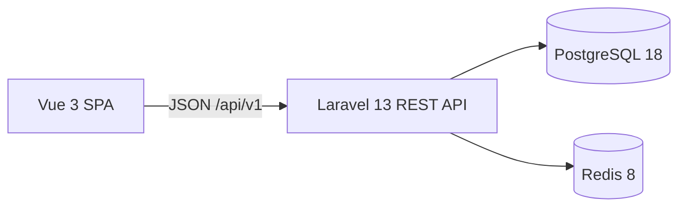

# System overview

CoreERP has two independently tooled applications in one Git repository:

The SPA owns presentation and navigation. Vue Router carries organization context; Axios handles HTTP; Pinia holds public authentication and organization state. Laravel owns the HTTP contract, authorization, and business rules. Controllers coordinate requests, an action performs transactional organization creation, Policies authorize organization access, and API Resources shape responses. PostgreSQL stores users, recovery tokens, organizations, and memberships. Redis stores cache and server-side sessions. Mailpit catches development email.

In local development Vite forwards API, Sanctum CSRF, and Fortify routes to Laravel. Sanctum reads the Laravel session. A production reverse proxy, TLS, deployment process, and scaling configuration remain outside this milestone.

## HTTP contract

| Route | Success | Failure | Purpose |
| --- | --- | --- | --- |
| `GET /api/v1/health` | 200, `{"data":{"status":"ok"}}` | Framework errors | Public liveness |
| `GET /api/v1/ready` | 200, `{"data":{"status":"ok"}}` | 503 | PostgreSQL and Redis readiness |
| `GET /api/v1/me` | 200, limited user resource | 401 | Current session user and verification status |
| `GET /api/v1/organizations` | 200, membership-scoped list | 401/403 | List verified user's organizations |
| `POST /api/v1/organizations` | 201, limited resource | 401/403/422 | Create organization and owner membership |
| `GET /api/v1/organizations/{organization}` | 200, limited resource | 401/403/404 | View a member organization |
| `PATCH /api/v1/organizations/{organization}` | 200, limited resource | 401/403/404/422 | Owner updates the name |

Operational endpoints reveal no user or tenant data. Readiness checks connectivity, not migration currency. API exception responses are JSON.

## Tenant boundary

Phase 1.2 uses shared-database, shared-schema tenancy. An organization has a public ULID, a name, and an explicit owner user. A first-class membership joins users and organizations. The owner must be a member, enforced by a deferred PostgreSQL foreign key and transactional creation. Memberships have no status or role. Future tenant-owned tables will reference `organizations.id`; every data path must apply server-side organization scoping and authorization.

The SPA selects context through `/app/organizations/{organizationId}` and reloads it from the API on refresh. There is no active organization stored on the user or in browser storage. The backend treats the route identifier as untrusted: the list uses a membership query, while show and update use `OrganizationPolicy`. A non-member gets 404 for an unrelated organization; a member who is not owner gets 403 when updating. Organization APIs require server-side email verification. RBAC and ERP data tables do not exist yet.

## Verification boundaries

Pest tests cover authentication, transaction rollback, PostgreSQL constraints, owner authorization, and cross-tenant isolation. Vitest covers client state and routing. Playwright exercises authentication, email verification, onboarding, refresh, and a second user's access denial. Pint, Larastan, ESLint, Prettier, TypeScript checking, audits, and production build are local quality gates.

See [ADR 0001](../decisions/0001-foundation.md), [ADR 0002](../decisions/0002-spa-authentication.md), [ADR 0003](../decisions/0003-multi-tenancy-and-organizations.md), and the [Phase 1 roadmap](../phases/phase-01-core-platform.md).
