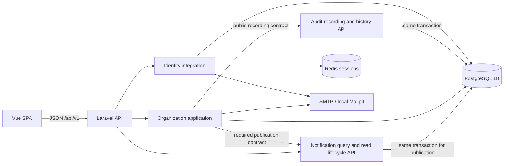

# System overview

CoreERP is a pragmatic DDD-oriented modular monolith with independent Laravel and Vue applications:

Phase 1.4 is implemented locally, awaiting review. Phase 1.5B is the approved, committed Audit persistence/contracts baseline. Phase 1.5C is approved and committed. Phase 1.5D invitation/member lifecycle integration is approved and committed as 91b0725. E Authorized Audit Query API is approved and committed as 904c04d: all eleven mutation facts record atomically and an authorized bounded read endpoint is available. F read-only Audit Trail UI/browser flow is complete locally for review. Phase 1.5 is not complete. Phase 1.6B Notification persistence/contracts is approved and committed as 1627633; C is approved/committed as 45ceea9; D adds required invitation acceptance owner publication locally for review. Phase 1.6 is incomplete and later ERP modules remain unimplemented. See [ADR 0005](../decisions/0005-ddd-modular-monolith-architecture.md), [ADR 0006](../decisions/0006-organization-membership-lifecycle-and-invitations.md), [ADR 0007](../decisions/0007-audit-trail-architecture.md), [ADR 0008](../decisions/0008-notification-center-architecture.md), the [roadmap](../phases/phase-01-core-platform.md) and checkpoint validation records.

## Bounded contexts and layers

Audit is a supporting module with Application contracts, readonly producer input, stable enums and strict action-specific payload validation, plus Infrastructure Query Builder persistence/provider wiring. E adds HTTP Presentation for the read API; there is no Domain layer or Eloquent audit model. The recorder requires a caller-owned physical PostgreSQL transaction and uses the default application connection. Explicit tenant/actor FKs, JSON/size constraints and unconditional statement-level UPDATE/DELETE/TRUNCATE rejection protect storage. All ten Organization write commands inject the public AuditRecorder contract and use OrganizationAuditEntries, a model-free Organization-owned projection. Producer imports are limited to Audit Application Contracts/Data/Vocabulary; Audit imports no Organization or Identity code. See ADR 0007 for schema, actor/privacy choices, operational limits and later integration.

Notification is an independent supporting module with Application, Infrastructure and C's HTTP Presentation. The unchanged publisher validates exact versioned payloads/semantic targets, renders plain-text snapshots and inserts through Query Builder in an existing physical default PostgreSQL transaction. Notification owns its membership-context port; only Organization's small Infrastructure adapter/provider references that port/context and resolves fresh active membership through OrganizationAccess and persisted queries. C adds list/unread count/mark-read/mark-all-read with independent Application authorization, typed projections and Query Builder reader/read-store ports. AcceptInvitation alone publishes through NotificationPublisher after Audit in its existing transaction, using the model-free OrganizationNotifications factory and locked organization owner ID. Business + Audit + Notification must commit together or all roll back. No Notification frontend, Domain, Eloquent model, email, queue or realtime implementation exists. See [ADR 0008](../decisions/0008-notification-center-architecture.md) and [validation](../phases/phase-01-notification-center-validation.md).

Notification rows are private to the triple organization_id/recipient_user_id/recipient_membership_id. The publisher resolves the recipient's trusted active membership; producer input has no recipientMembershipId. Suspension/reactivation preserves the era; removal retains inaccessible rows, and later rejoining with a new membership does not restore them. Historical recipient_membership_id has a positive constraint but no live FK, preserving removal without deletion or loss of era. Every C list/count/read write independently applies all three predicates using current active context. Owner authority does not expose another recipient's rows. Organization/user deletion cascades notification history, subject to existing independent deletion restrictions. The sole published type is organization.invitation_accepted, with safe identifiers and organization.users/null-ID target; reads tolerate stored future type/version values. The accepting membership ID in payload is distinct from the owner membership era resolved internally by the publisher. The draft contains no invitation credentials, hashes, emails, URL or role IDs; acceptance sends no new mail. Issuance/reinvite and all other business paths publish no notifications.

C exposes exactly four authenticated/verified routes under /api/v1/organizations/{organization}/notifications: GET collection, GET unread-count, POST {notification}/read and POST read-all. List authorization precedes detailed cursor/per_page validation in HTTP and direct Application calls. Descending created_at/id keyset pagination is bounded to 1–100 (default 25) and grouped inside recipient/era scope; no totals, joins, OFFSET or raw payload selection. API projections include plain snapshots, stored type/version, semantic target and microsecond UTC dates. Conditional read_at updates preserve first-read time and use database time clamped to creation; mark-all is one statement over current-era unread rows, and later inserts may remain unread. Hidden membership gets 404; private item absence/foreign scope/old era shares one fixed 404. No permission/capability, read-side Audit event or migration is added.

Identity owns credentials, registration, login/logout, email verification, password recovery and the current-user representation. Its existing Eloquent User, Fortify adapters/provider, HTTP responses and current-user controller/resource remain in Infrastructure and Presentation. No artificial Identity Domain/Application layers are needed. Identity has no Organization dependency.

Organization owns tenant identity, ownership, memberships, tenant roles/permissions/grants and invitations together. New functionality belongs in these layers:

| Layer | Responsibilities |
| --- | --- |
| Domain | PermissionKey, MembershipStatus, InvitationState; pure role tenant compatibility, owner membership protection and verified invitation identity/lifecycle rules |
| Application | Explicit actor/tenant authorization, commands, queries, transaction boundaries and row locking |
| Infrastructure | Eloquent models/relationships, OrganizationPolicy/AccessResponse adapters, provider and synchronous SMTP invitation delivery |
| Presentation | Thin HTTP controllers, authorization-first Form Requests, deliberate Resources and Domain/Application failure mapping |

Application uses documented same-module Eloquent/DB lightweight paths and a concrete Organization SMTP adapter. Domain is framework-independent. No duplicate aggregates, repositories, buses, events, hidden model-observer workflows, generic Shared Kernel or future modules were introduced. Platform liveness/readiness remain outside business contexts. Migrations, routes, configuration, factories and seeders retain conventional Laravel locations.

Seven Organization adapters reference Identity User: Organization::owner, OrganizationMembership::user, OrganizationPolicy and four authenticated HTTP controllers (organization, role, member and invitation). Application receives explicit trusted user ID/email/verification values; it imports no Identity Infrastructure. Relationship-based member reads expose only deliberate User columns. Architecture allowlists are precise, not a general cross-context exception.

## Application and domain behavior

Existing `CreateOrganization`, `RenameOrganization`, `SaveRole`, `ListOrganizations` and internal `AssignMembershipRole` remain. New commands are `CreateInvitation`, `AcceptInvitation`, `RevokeInvitation`, `SyncMembershipRoles`, `SuspendMembership`, `ActivateMembership` and `RemoveMembership`. Internal `ResolveOrganizationRoles` and `LockManagedMembership` share only the concrete tenant/locking operations their callers need.

CreateOrganization records organization.created after owner membership bootstrap in the same transaction. RenameOrganization now locks a fresh persisted row and records its actual before/after names, then synchronizes the supplied model instance after success. SaveRole retains its scoped lock/transaction and records role.created or role.updated after grants persist; update payloads include changed fields only, with sorted unique permission keys. Rename and role no-ops produce no event. Audit failure rolls back business changes and history together. Existing authorization, typed permissions, duplicate-name HTTP 422 and response contracts remain unchanged. D extends the same projection to invitation creation/replacement/revocation/acceptance, complete membership role-set changes, suspension/activation and removal. All snapshots come from locked persisted state and actual grants; list IDs are sorted/unique, repeated state/set no-ops create no history. Removal captures before deletion and records afterward. Internal AssignMembershipRole and lock/role-resolution operations remain uninstrumented. Invitation credentials, email, URLs and mail bodies never enter these facts.

Controllers do not write business data or own transactions. Policies and directly invoked authorized writes reuse OrganizationAccess. Membership commands lock the organization then the scoped membership; invitation commands use organization then invitation. `AcceptInvitation` validates the token, verified matching email, state and expiration before creating the membership, calling AssignMembershipRole for all grants and marking the invitation accepted inside one transaction. Existing membership is always rejected, including suspended membership.

Domain tests do not boot Laravel or touch a database. `MembershipRules` rejects owner suspension/removal. `InvitationRules` normalizes email, requires a verified matching identity and checks the pending/unexpired state using supplied time. `RoleAssignmentRules` requires same-organization grants. PostgreSQL independently protects these persistence invariants where practical; pure rules do not replace constraint tests.

## Tenancy, membership and authorization

Organizations use public ULIDs in a shared schema. Membership IDs retain existing bigint conventions; invitation and role IDs are ULIDs. Tenant context comes explicitly from the route/use-case arguments, never a global, session-selected tenant, User current organization or browser storage. All future tenant-owned tables must carry scoped keys and authorization.

Memberships now have `active`/`suspended` status. Suspension retains roles but removes organization access and effective RBAC on subsequent checks. ListOrganizations includes active memberships only. Reactivation reuses the existing membership and grants. Removal deletes membership and cascades its grant links, leaving User and Role definitions intact.

Owner identity remains the explicit `owner_user_id`, independent of roles. The owner must have an active membership. The original deferred owner-membership FK is retained and strengthened by a second deferred composite active-status FK. Creation still inserts organization and owner membership atomically. No ownership transfer/deletion workflow exists.

OrganizationAccess queries persisted membership/ownership and, when needed, tenant-scoped permission EXISTS. There is no cache or reliance on loaded grants. ALLOWED, HIDDEN and FORBIDDEN remain the decision vocabulary: guests receive 401; unverified users 403; non-members and suspended members 404; active members lacking authority 403.

| Capability | Authority |
| --- | --- |
| Workspace | Active member |
| Rename | Owner or `organizations.update` |
| Role/catalog read | Owner or `roles.view` |
| Role definition writes | Owner only |
| Member list | Owner or `members.view` |
| Invitation list and roleless issuance/revocation/reinvite | Owner or `members.invite` |
| Invitation role selection, or replacing/revoking role-bearing invitations | Owner only |
| Member role synchronization and lifecycle | Owner only |

Role names never confer ownership. Permission keys are enum-defined and migration-allowlisted. Two new keys have real behavior; no generic `members.manage` or future permission exists. Frontend capability flags only guide presentation.

## Invitation security and persistence

Invitations persist organization, normalized email, inviter, SHA-256 token hash, expiration and pending/accepted/revoked state. Expired is derived, not persisted. The seven-day duration is centralized. A partial unique pending-email index has a stable state predicate; no `now()` index expression is used. Expired pending rows still occupy that key until reinvite/revocation.

Issuance uses 32 random bytes and stores only their SHA-256 hash. Reinvite transactionally revokes the previous pending invitation, rotates the ID/credential and selected roles. Revocation is repeatable and never removes accepted memberships. Acceptance requires a trusted authenticated verified matching email, not just possession. No User is auto-created.

Acceptance/reinvite/revoke serialize on organization-first row locks. The existing membership unique constraint is authoritative. A real two-connection test observes lock contention and proves one acceptance plus one replay rejection. Rollback tests prove there is no partial membership, grant or accepted state. Invitation-role and membership-role pivots each have composite tenant FKs; raw corruption tests reject foreign IDs and forged pivot tenant values. Invitation/role deletion cascades invitation grants. Inviter user deletion is restricted while an invitation references it.

SMTP mail is synchronous after commit and uses an Infrastructure Mailable. A non-SMTP invitation transport is rejected so credentials cannot enter the log mailer. Mailpit remains local delivery. Transport/view exceptions are sanitized without retaining their credential-bearing traces. HTTP 503 explains delivery failure and leaves the committed invitation; refreshing/reinviting rotates and retries. Reliable queued delivery/outbox behavior is outside Phase 1.4.

## HTTP and SPA

Existing health/readiness, `/me`, organization and RBAC contracts remain. All business routes use `/api/v1`, authenticated verified sessions and scoped organization binding. New endpoints are listed in [ADR 0006](../decisions/0006-organization-membership-lifecycle-and-invitations.md#boundaries-http-and-email): member/invitation lists, invitation create/revoke/accept, explicit member roles/suspend/activate/remove commands, and a small `users-access` capability representation. There is no generic membership PATCH. Invitation creation/acceptance are throttled.

Member Resources allowlist membership ID, user ID/name/email, status, roles and is_owner. Invitation Resources expose ID/email/state/expiration/roles only. Tokens/hashes, password/session/verification internals and pivots are absent. Expected invitation errors render safe reason/message pairs and are not logged; token input is never flashed.

The SPA keeps public auth/organization state in Pinia; users/roles/invitations remain view-local. The organization comes from the route, with stale tenant responses discarded. `/app/organizations/:organizationId/users` provides members and invitations, owner-only lifecycle/role controls, and roleless delegated invitation controls. The existing workspace and Roles & Permissions UI remain.

`/invitations/:invitationId/accept#token=...` captures the token in memory and replaces the URL without the fragment. No localStorage, sessionStorage or persisted Pinia is used. Guests reuse login/register, unverified users reuse verification, and verified users explicitly accept. Pending in-memory navigation returns to acceptance. Open verification in another tab and return to “I've verified”; after full reload/same-tab verification, reopen the original invitation email. Wrong email allows account switching; expired/revoked/accepted/invalid invitations show terminal errors; success enters the workspace. Server authorization remains authoritative.

Sanctum, Fortify, CSRF, Redis sessions, password reset and verification behavior are preserved. Vite provides the existing same-origin development proxy. PostgreSQL and Redis readiness checks remain read-only and disclose no tenant data.

## Verification and operational limits

Pest covers Unit, Application, Architecture, Auth, organizations, RBAC, new lifecycle/identity/tenant failures, PostgreSQL constraints and real concurrency. Architecture checks discover new Domain/Application/controller classes and continue forbidding framework dependencies in Domain, Presentation/HTTP/Gate/ambient auth in Application, controller mutations/transactions, and Identity → Organization dependencies. Static checks supplement runtime security tests.

Vitest covers member/invitation workflows, owner/delegation controls, failure rendering, acceptance states and memory return navigation. Playwright includes the full real-Mailpit multi-user registration/verification/invitation/role/suspend/reactivate/remove flow, alongside prior suites. Backend database suites run sequentially and separately from browser writes. The invitation concurrency test commits into the explicitly configured, guarded coreerp_concurrency_test database, observes two real sessions waiting and proves one acceptance fact and exactly one correctly scoped owner notification from the winning command. A physical rollback test uses real Audit and Notification inserts followed by a test-only exception before commit, leaving neither fact nor the accepted membership/grants/state. Test-only administrative create/drop is restricted to testing, the fixed previously absent target and a database distinct from configured/actual application defaults. Workers enforce the same target. Whole-database cleanup restores connections without deleting audit rows or disabling protections. Physical mail/commit tests use this disposable scope too; run these suites sequentially and never reuse a pre-existing target. Storage/cascade tests also use raw fixtures when testing historical deletion mechanics; command-created organizations are proven deletion-restricted by retained history. Other feature tests retain outer transactions and migration tests flush deferred constraints before schema changes.

Existing administration lists remain unpaginated; Audit and Notification history use mandatory bounded keyset pagination. The coarse tenant row lock favors correctness at current administrative scale. Previously known limitations remain: true cross-origin deployments need CORS method review (GET/POST/OPTIONS currently configured), and framework missing-model messages can differ from policy-hidden 404 messages. Production TLS, SMTP provider, reverse proxy and deployment hardening remain separate work. Phase 1.5 is implemented through F locally for review; Phase 1.6B/C are committed and D adds only the required invitation acceptance owner producer locally for review. Frontend E remains pending; Phase 1.6 is incomplete. Generic email delivery, Horizon/queues, retries/outbox, Reverb/realtime and notification preferences are deferred separately.

### Authorized Audit history (Phase 1.5E)

GET /api/v1/organizations/{organization}/audit-events accepts explicit tenant ULID context and authenticated verified actors. Organization owns audit.view and fresh membership/owner/RBAC evaluation; its Infrastructure adapter implements AuditHistoryAccess, bound explicitly in OrganizationServiceProvider. Audit imports no Organization/Identity code. Owner or active audit.view member is allowed, ordinary active member gets 403, suspended/nonmember gets 404. Authorization precedes detailed query validation in both HTTP Form Request and the independent ListAuditEvents Application entry point.

AuditEventReader is an internal read port; Query Builder Infrastructure returns readonly projections with deliberate fields. Every SQL read scopes organization first; existing indexes support descending created_at/id keyset pagination and optional exact action or paired subject_type/subject_id filters. per_page defaults to 25 and is bounded 1–100. The unsigned version-1 base64url cursor is strictly parsed (256-byte maximum, exact timestamp/ULID fields) and represents position only. Tenant scope survives cross-tenant cursor replay. Reads fetch at most per_page+1, never count totals or use OFFSET/user joins.

Resource data: id, action, actor type/id (system id null), subject type/string id, changes before/after, payload_version, canonical UTC time. Metadata: next_cursor, has_more, per_page. No actor PII, invitation credentials or relations. Organization SHOW alone adds meta.can_view_audit from OrganizationAccess; lists/data shape remain unchanged and the audit endpoint authorizes independently. Existing invitation throttles do not cover general reads; a production read rate policy is deferred. See ADR 0007 and validation for security, SQL, cursor and migration proofs. F frontend is implemented locally for review.

### Audit Trail UI (Phase 1.5F)

The authenticated/verified `/app/organizations/:organizationId/audit` page consumes the E contract through a typed GET-only client. Workspace SHOW context/capability and history are view-local; only can_view_audit=true exposes navigation. Every API page still authorizes independently. The page displays stable actor/subject IDs, UTC time, readable action labels and expandable finite version-1 changes; unknown versions get a safe details fallback. Vue text interpolation escapes business values.

Initial load, Refresh and filters fetch fresh context; cursor Load more remains tenant-scoped. Request-generation checks prevent stale tenant responses, and denial clears history. Action/paired-subject filters and fixed 25-event pages use the existing API; no totals, actor lookup, browser storage, Pinia history cache or mutations. Draft and applied filters stay separate. Browser flows cover owner/delegated reads, real pagination, tenant switching, permission revocation, suspension/reactivation/removal, authentication and hiding. F is awaiting review; backend and migrations are unchanged and Phase 1.5 is not marked complete.
