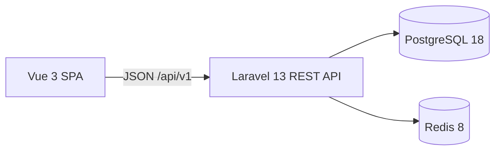

# System overview

CoreERP has two independently tooled applications in one Git repository:

The SPA owns presentation and navigation. Vue Router carries organization context; Axios handles HTTP; Pinia holds public authentication and organization state. Laravel owns the HTTP contract, authorization, and business rules. Controllers coordinate requests, an action performs transactional organization creation, Policies authorize organization access, and API Resources shape responses. PostgreSQL stores users, recovery tokens, organizations, memberships, organization roles, permission definitions, and relational grants. Redis stores cache and server-side sessions. Mailpit catches development email.

In local development Vite forwards API, Sanctum CSRF, and Fortify routes to Laravel. Sanctum reads the Laravel session. A production reverse proxy, TLS, deployment process, and scaling configuration remain outside this milestone.

## HTTP contract

| Route | Success | Failure | Purpose |
| --- | --- | --- | --- |
| `GET /api/v1/health` | 200, `{"data":{"status":"ok"}}` | Framework errors | Public liveness |
| `GET /api/v1/ready` | 200, `{"data":{"status":"ok"}}` | 503 | PostgreSQL and Redis readiness |
| `GET /api/v1/me` | 200, limited user resource | 401 | Current session user and verification status |
| `GET /api/v1/organizations` | 200, membership-scoped list | 401/403 | List verified user's organizations |
| `POST /api/v1/organizations` | 201, limited resource | 401/403/422 | Create organization and owner membership |
| `GET /api/v1/organizations/{organization}` | 200, limited resource | 401/403/404 | View a member organization |
| `PATCH /api/v1/organizations/{organization}` | 200, limited resource | 401/403/404/422 | Owner or member with `organizations.update` updates the name |
| `GET /api/v1/organizations/{organization}/roles` | 200, roles and `meta.can_manage` | 401/403/404 | Owner or `roles.view` reads tenant roles |
| `GET /api/v1/organizations/{organization}/permissions` | 200, key/label catalog | 401/403/404 | Owner or `roles.view` reads application capabilities |
| `POST /api/v1/organizations/{organization}/roles` | 201, role resource | 401/403/404/422 | Owner creates a role with permissions |
| `PATCH /api/v1/organizations/{organization}/roles/{role}` | 200, role resource | 401/403/404/422 | Owner replaces role name and permission set |

Role writes require both `name` and `permissions` (an empty array clears grants). The role resource exposes only ID, name and sorted permission keys. Scoped binding and Policies protect every role route. Role-name uniqueness ignores case and ordinary surrounding spaces within one organization.

Operational endpoints reveal no user or tenant data. Readiness checks connectivity, not migration currency. API exception responses are JSON.

## Tenant boundary

Phase 1.2 uses shared-database, shared-schema tenancy. An organization has a public ULID, a name, and an explicit owner user. A first-class membership joins users and organizations. The owner must be a member, enforced by a deferred PostgreSQL foreign key and transactional creation. Memberships have no lifecycle status; they may hold multiple organization-scoped roles. Future tenant-owned tables will reference `organizations.id`; every data path must apply server-side organization scoping and authorization.

The SPA selects context through `/app/organizations/{organizationId}` and reloads it from the API on refresh. There is no active organization stored on the user or in browser storage. The backend treats the route identifier as untrusted: the list uses a membership query, while show and update use `OrganizationPolicy`. A non-member gets 404 for an unrelated organization; a member lacking `organizations.update` gets 403 when updating. Organization APIs require server-side email verification. ERP data tables do not exist yet.

## Organization authorization

Phase 1.3 relates organization memberships to organization roles through a pivot with two composite foreign keys. PostgreSQL requires the membership and role to belong to the same organization, independently of HTTP validation. Roles relate to application-defined permission records through a unique relational pivot. `PermissionKey` defines `organizations.update` and `roles.view`; the versioned migration inserts those keys and a database check rejects arbitrary keys.

`OrganizationMembership::hasPermission(organization, permission)` evaluates the union of assigned roles after confirming persisted membership in that organization. Explicit owners pass without an Owner role. `OrganizationPolicy` delegates capability checks to that method, retains membership-only workspace viewing, and reserves role writes for the explicit owner. No default roles or ownership backfill are needed. Permission evaluation queries current records; caching is deferred. Lists eager-load grants.

The Roles & Permissions SPA route is `/app/organizations/{organizationId}/roles`. It lists roles and allows owners to create/edit names and permission sets. Readers with `roles.view` receive a read-only catalog. The API's `can_manage` flag is a presentation hint only. This view keeps API results locally and discards stale responses after tenant navigation. Membership-role assignment is internal and tested, with no public assignment or member-management API until Phase 1.4.

## Verification boundaries

Pest tests cover authentication, transaction rollback, PostgreSQL constraints, owner authorization, cross-tenant isolation, permission unions, revocation, RBAC constraints, and migration compatibility. Vitest covers client state and routing. Playwright exercises authentication, email verification, onboarding, refresh, a second user's access denial, and role creation/editing with persistence after refresh. Pint, Larastan, ESLint, Prettier, TypeScript checking, audits, and production build are local quality gates.

See [ADR 0001](../decisions/0001-foundation.md), [ADR 0002](../decisions/0002-spa-authentication.md), [ADR 0003](../decisions/0003-multi-tenancy-and-organizations.md), [ADR 0004](../decisions/0004-organization-scoped-rbac.md), and the [Phase 1 roadmap](../phases/phase-01-core-platform.md).
