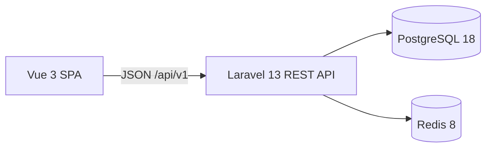

# System overview

CoreERP has two independently tooled applications in a single Git repository:

The Vue SPA owns presentation and client interaction. Vue Router handles navigation, Axios handles HTTP, and Pinia holds the authenticated user's public state. Other server responses are not automatically copied into global stores. The readiness result remains local component state.

Laravel owns the HTTP contract and will own authorization and business rules in future milestones. Controllers coordinate requests, services perform work, and API Resources shape responses. The current service only checks infrastructure readiness; no domain/service/repository abstraction hierarchy is introduced.

PostgreSQL is the durable system of record for users and password-reset tokens. Redis is the cache and server-side session backend. Queue execution remains synchronous. Persistent Compose volumes retain database and Redis data across container recreation. Mailpit catches verification and reset messages locally.

In local development the browser uses the Vue origin. Vite forwards `/api`, Sanctum CSRF bootstrap, and Fortify mutation routes to Laravel over the internal Compose network. The application API authenticates through Sanctum's stateful middleware and a Laravel session cookie. CORS names only the configured SPA origin. A production reverse proxy, TLS, deployment process, and scaling configuration are outside Phase 1.1.

## Current HTTP contract

| Route | Success | Failure | Purpose |
| --- | --- | --- | --- |
| `GET /api/v1/health` | 200, `{"data":{"status":"ok"}}` | Framework errors | Application liveness, without data dependencies |
| `GET /api/v1/ready` | 200, `{"data":{"status":"ok"}}` | 503, `{"data":{"status":"unavailable"}}` | PostgreSQL `SELECT 1` and Redis `PING` |
| `GET /api/v1/me` | 200, limited user resource | 401 | Current session user, including verification status |

Dependency error details are logged server-side and omitted from readiness responses. These operational endpoints are intentionally public and contain no user or domain data. Readiness does not certify schema currency. API exception responses are JSON.

## Future tenancy boundary

The long-term ERP will be multi-tenant. **Tenancy is not implemented in Phase 1.0.** No organization model, tenant context, query scoping, membership, RBAC, or cross-tenant isolation exists. A future decision must define the tenancy model, database invariants, authorization boundary, and isolation tests before tenant data is introduced.

Phase 1.1 adds user authentication without tenant context. Fortify provides browser authentication routes and Sanctum reads the resulting session for the API. The standard Laravel User model and existing users/password-reset migration now support account creation and recovery. There are no seeded identities or API tokens. The minimal `/app` screen is protected by a Vue guard and contains no ERP data. Server-side verification and authorization must be applied to future protected API resources.

## Verification boundaries

Pest feature tests cover API and authentication behavior; a separate integration group probes actual PostgreSQL and Redis. Vitest/Vue Test Utils cover the shell, authentication state, guards, and error feedback. Playwright exercises the real browser, cookies, CSRF, email link, refresh, and logout. Pint, Larastan level 8, ESLint, Prettier, TypeScript checking, and a production asset build run in CI using the local Compose images.

See [ADR 0001](../decisions/0001-foundation.md), [ADR 0002](../decisions/0002-spa-authentication.md), and the [Phase 1 roadmap](../phases/phase-01-core-platform.md).
