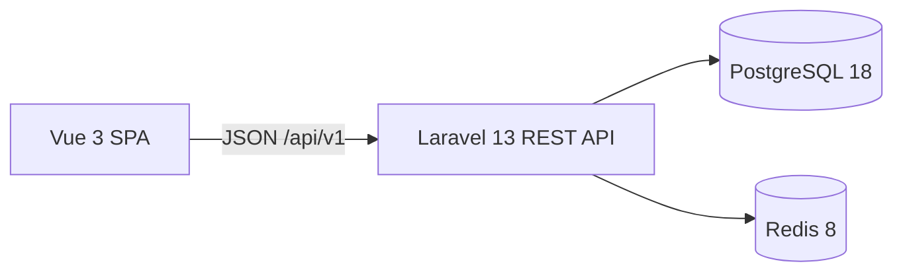

# System overview

CoreERP has two independently tooled applications in one Git repository:

The SPA owns presentation and navigation. Vue Router carries organization context; Axios handles HTTP; Pinia holds public authentication and organization state. Laravel owns the HTTP contract, authorization, and business rules. Controllers coordinate requests, an action performs transactional organization creation, Policies authorize organization access, and API Resources shape responses. PostgreSQL stores users, recovery tokens, organizations, memberships, organization roles, permission definitions, and relational grants. Redis stores cache and server-side sessions. Mailpit catches development email.

In local development Vite forwards API, Sanctum CSRF, and Fortify routes to Laravel. Sanctum reads the Laravel session. A production reverse proxy, TLS, deployment process, and scaling configuration remain outside this milestone.

## Current structure and architecture groundwork

Phase 1.3 is implemented. Phase 1.3.5A established guardrails, B extracted listing/rename operations, C mechanically moved Organization into `App\Modules\Organization`, D centralized Organization authorization, and **E extracted the first pure Domain invariant and cleaned up Application failures**. Identity (including User, Fortify, and `/me`) and platform health/readiness remain in conventional namespaces.

| Current module layer | Contents |
| --- | --- |
| Domain/Authorization | Pure `PermissionKey` enum |
| Domain/Memberships | RoleAssignmentRules and CrossOrganizationRoleAssignment |
| Application/Authorization | OrganizationAccess, AccessDecision, AccessDenied |
| Application/Commands | CreateOrganization, RenameOrganization, SaveRole |
| Application/Operations | AssignMembershipRole |
| Application/Queries | ListOrganizations |
| Application/Exceptions | RoleNameConflict |
| Infrastructure/Eloquent/Models | Organization, OrganizationMembership, Role, Permission |
| Infrastructure/Authorization | OrganizationPolicy adapter and AccessResponse Laravel translation |
| Infrastructure/Providers | OrganizationServiceProvider, explicit model-to-policy registration |
| Presentation/Http | Two controllers, three Form Requests, three Resources, OrganizationFailureMapper |

OrganizationController delegates listing, creation, and rename; show authorizes the route-bound model. RenameOrganization and SaveRole now receive an explicit actor ID and independently require OrganizationAccess approval before mutation. Form Requests still authorize early through Policies before input validation. Both boundaries use the same persisted decision logic. Eloquent remains in Infrastructure and lightweight Application paths use it directly.

OrganizationAccess accepts actor and organization IDs. AccessDecision distinguishes ALLOWED, HIDDEN and FORBIDDEN and carries the existing application-owned denial message. Policies translate decisions through AccessResponse; Application writes throw AccessDenied on denial. A narrowly registered exception mapping in bootstrap/app.php reuses AccessResponse to produce Laravel AuthorizationException, preserving the existing HTTP renderer and 404/403 distinction. The evaluator never invokes Gate, Policies, ambient authentication, or HTTP helpers.

Remaining temporary dependencies: Infrastructure owner/user relationships and the Policy reference `App\Models\User`; CreateOrganization accepts the explicit owner and reads its key; Presentation uses User for authenticated input. User retains its inverse membership relationship. Organization Application no longer depends on ValidationException or HTTP authorization helpers. Broader RBAC read-query extraction and Identity migration remain deferred.

## Domain invariant and Application failures

RoleAssignmentRules requires exact equality between explicit membership and role organization ID strings and raises CrossOrganizationRoleAssignment on mismatch. It has no framework, persistence, or HTTP dependencies. Pure Unit tests run without Laravel or PostgreSQL. AssignMembershipRole remains internal: callers supply the already-loaded records and authorize membership administration; the operation invokes the rule and performs the existing idempotent pivot synchronization. It adds no actor authorization, lookup, endpoint, or transaction. PostgreSQL composite foreign keys remain the final integrity boundary, including when supplied model attributes are stale or spoofed. The pure check gives an early business failure; it cannot verify persisted state by itself.

SaveRole retains OrganizationAccess authorization, tenant-scoped row lookup, transaction, row locking and grant replacement. Its permission arguments are now variadic PermissionKey enum values. SaveRoleRequest converts validated strings after its unchanged authorization and validation; the HTTP payload remains an array of strings. Direct callers pass enums (or no permission arguments to clear grants); invalid runtime types fail before mutation. The database allowlist and permission foreign key still protect direct SQL corruption.

The existing PostgreSQL duplicate-name detection now raises RoleNameConflict after rollback. OrganizationFailureMapper in Presentation maps that specific failure to Laravel's existing 422 name-field validation response; it maps CrossOrganizationRoleAssignment to the existing role-field response. bootstrap/app.php registers the two exact mappings. Domain/Application failures contain no HTTP codes or JSON construction. Unknown HTTP keys remain Form Request errors, while a direct caller passing a string instead of an enum is a programming TypeError, not an HTTP validation result. Unrelated database failures still propagate normally. No generic exception hierarchy or repository was introduced.

## Target architecture (partially implemented)

[ADR 0005](../decisions/0005-ddd-modular-monolith-architecture.md) approves a DDD-oriented modular monolith with a pragmatic Application layer and CQRS-lite:

- **Identity** owns user identity, credentials, authentication, recovery, verification, and current-user representation.
- **Organization** owns tenant identity, ownership, memberships, roles, permission catalog/grants, and organization authorization. Membership and tenant RBAC stay together.
- Modules have Domain, Application, Infrastructure, and Presentation layers only where actual code needs them. No empty future ERP modules or Shared Kernel are created.
- Domain remains framework-independent. Lightweight Application paths may use same-module Eloquent and Laravel transactions; richer aggregates/repositories are introduced only when actual invariants justify them. This is not strict Clean Architecture everywhere.
- Controllers invoke direct write use cases/queries. Reads may use efficient Eloquent/query-builder/SQL. No buses, event sourcing, separate read database, or new domain events.
- Policies are Laravel adapters over the shared Organization access evaluator. Explicit tenant scope, constraints, binding, authorization ordering, and transaction semantics remain authoritative.

Acceptance: **same business behavior, HTTP API, frontend, database, and tenant/security semantics; different backend architecture**. Identity migration and remaining domain/application extraction are future checkpoints, each requiring authorization.

## HTTP contract

| Route | Success | Failure | Purpose |
| --- | --- | --- | --- |
| `GET /api/v1/health` | 200, `{"data":{"status":"ok"}}` | Framework errors | Public liveness |
| `GET /api/v1/ready` | 200, `{"data":{"status":"ok"}}` | 503 | PostgreSQL and Redis readiness |
| `GET /api/v1/me` | 200, limited user resource | 401 | Current session user and verification status |
| `GET /api/v1/organizations` | 200, membership-scoped list | 401/403 | List verified user's organizations |
| `POST /api/v1/organizations` | 201, limited resource | 401/403/422 | Create organization and owner membership |
| `GET /api/v1/organizations/{organization}` | 200, limited resource | 401/403/404 | View a member organization |
| `PATCH /api/v1/organizations/{organization}` | 200, limited resource | 401/403/404/422 | Owner or member with `organizations.update` updates the name |
| `GET /api/v1/organizations/{organization}/roles` | 200, roles and `meta.can_manage` | 401/403/404 | Owner or `roles.view` reads tenant roles |
| `GET /api/v1/organizations/{organization}/permissions` | 200, key/label catalog | 401/403/404 | Owner or `roles.view` reads application capabilities |
| `POST /api/v1/organizations/{organization}/roles` | 201, role resource | 401/403/404/422 | Owner creates a role with permissions |
| `PATCH /api/v1/organizations/{organization}/roles/{role}` | 200, role resource | 401/403/404/422 | Owner replaces role name and permission set |

Role writes require both `name` and `permissions` (an empty array clears grants). The role resource exposes only ID, name and sorted permission keys. Scoped binding and Policies protect every role route. Role-name uniqueness ignores case and ordinary surrounding spaces within one organization.

Operational endpoints reveal no user or tenant data. Readiness checks connectivity, not migration currency. API exception responses are JSON.

## Tenant boundary

Phase 1.2 uses shared-database, shared-schema tenancy. An organization has a public ULID, a name, and an explicit owner user. A first-class membership joins users and organizations. The owner must be a member, enforced by a deferred PostgreSQL foreign key and transactional creation. Memberships have no lifecycle status; they may hold multiple organization-scoped roles. Future tenant-owned tables will reference `organizations.id`; every data path must apply server-side organization scoping and authorization.

The SPA selects context through `/app/organizations/{organizationId}` and reloads it from the API on refresh. There is no active organization stored on the user or in browser storage. The backend treats the route identifier as untrusted: the list uses a membership query, while show and update use `OrganizationPolicy`. A non-member gets 404 for an unrelated organization; a member lacking `organizations.update` gets 403 when updating. Organization APIs require server-side email verification. ERP data tables do not exist yet.

## Organization authorization

Phase 1.3 relates organization memberships to organization roles through a pivot with two composite foreign keys. PostgreSQL requires the membership and role to belong to the same organization, independently of HTTP validation. Roles relate to application-defined permission records through a unique relational pivot. `PermissionKey` defines `organizations.update` and `roles.view`; the versioned migration inserts those keys and a database check rejects arbitrary keys.

`OrganizationAccess` now owns the actor rules previously distributed across OrganizationPolicy and OrganizationMembership::hasPermission (the model method was removed). Workspace viewing requires membership. Updating requires explicit ownership or `organizations.update`; role/catalog reading requires ownership or `roles.view`; role creation/editing remains owner-only. Ownership comes from persisted `organizations.owner_user_id`, never a role name or supplied owner flag.

Each decision queries persisted membership and ownership together. A non-owner permission decision uses a second tenant-scoped EXISTS query across assigned roles and permissions. No loaded relationship collection or permission cache participates; revocation is visible on the next check. Role unions remain intact. Membership is required even for owners, consistent with the deferred database invariant. One decision needs one or two queries independent of the number of roles; ListOrganizations remains its existing membership-scoped query without per-row evaluation.

Identity authentication/verification remain HTTP middleware responsibilities; Application callers supply trusted actor identity and validated inputs. Authorization checks are fresh at invocation, not a new concurrency guarantee: transaction isolation and role-write locking are unchanged, and concurrent revocation after a decision is not serialized by this checkpoint.

The Roles & Permissions SPA route is `/app/organizations/{organizationId}/roles`. It lists roles and allows owners to create/edit names and permission sets. Readers with `roles.view` receive a read-only catalog. The API's `can_manage` flag is a presentation hint only. This view keeps API results locally and discards stale responses after tenant navigation. Membership-role assignment is internal and tested, with no public assignment or member-management API until Phase 1.4.

## Verification boundaries

Pest tests cover authentication, transaction rollback, PostgreSQL constraints, owner authorization, cross-tenant isolation, permission unions, revocation, RBAC constraints, and migration compatibility. Vitest covers client state and routing. Playwright exercises authentication, email verification, onboarding, refresh, a second user's access denial, and role creation/editing with persistence after refresh. Pint, Larastan, ESLint, Prettier, TypeScript checking, audits, and production build are local quality gates.

The Architecture suite runs with backend quality without booting Laravel. Current controller/dependency/global-state checks are active; Organization Domain/Application checks now run with no skips; model/ambient-context guards include the module. They complement, rather than prove, authorization and tenant isolation. Characterization covers application-owned errors, denial-before-validation ordering, resource status/shape, scoped binding, policy/factory/Fortify resolution, and unverified `/me`. See [Phase 1.3.5 validation](../phases/phase-01-ddd-architecture-validation.md) for observed results and limitations.

## Deferred compatibility concerns

Current 404 status hiding does not make error bodies indistinguishable. With debug disabled, a policy-hidden organization returns `{"message":"Not Found"}`; missing-model and foreign-role binding failures contain Laravel's model class/identifier message. Tests preserve status and the message-only envelope without making framework class names a public contract. C naturally changes the incidental model class text to `App\Modules\Organization\Infrastructure\Eloquent\Models\Organization` or `Role`; policy-hidden responses remain `Not Found`. No normalization is performed; any future normalization needs a separate security/API decision.

`config/cors.php` currently allows GET, POST, and OPTIONS, but not PATCH. A true cross-origin PATCH preflight consequently lacks PATCH in `Access-Control-Allow-Methods`. The supported local SPA uses Vite's same-origin proxy; a cross-origin deployment needs separate CORS review. Configuration remains unchanged.

Feature tests use the configured PostgreSQL database with outer transactions; there is no dedicated database name in phpunit.xml. One existing migration test drops/reapplies RBAC tables within that transaction, and deferred-constraint tests use explicit checks/savepoints. Keep tests sequential and separate backend tests from browser writes. This checkpoint does not alter the database-testing strategy.

See [ADR 0001](../decisions/0001-foundation.md), [ADR 0002](../decisions/0002-spa-authentication.md), [ADR 0003](../decisions/0003-multi-tenancy-and-organizations.md), [ADR 0004](../decisions/0004-organization-scoped-rbac.md), and the [Phase 1 roadmap](../phases/phase-01-core-platform.md).
